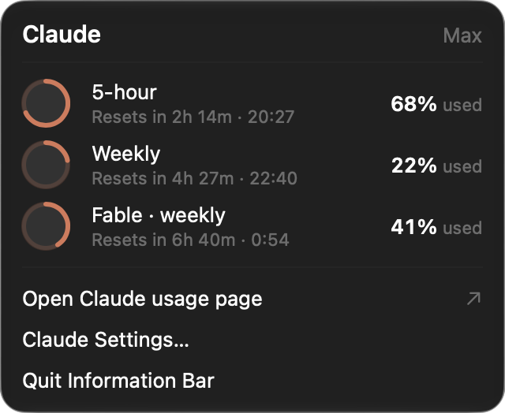
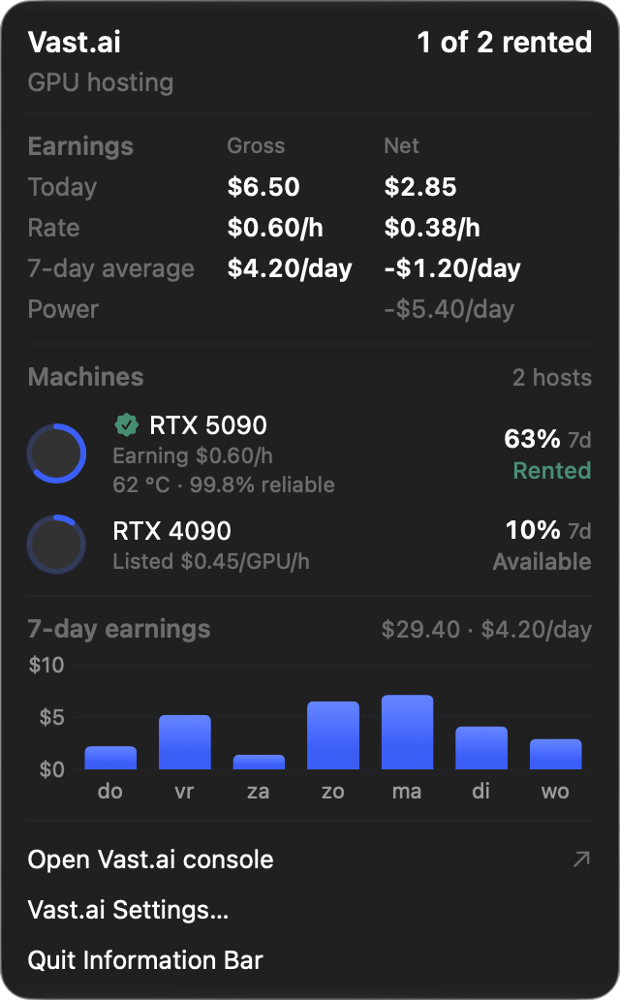
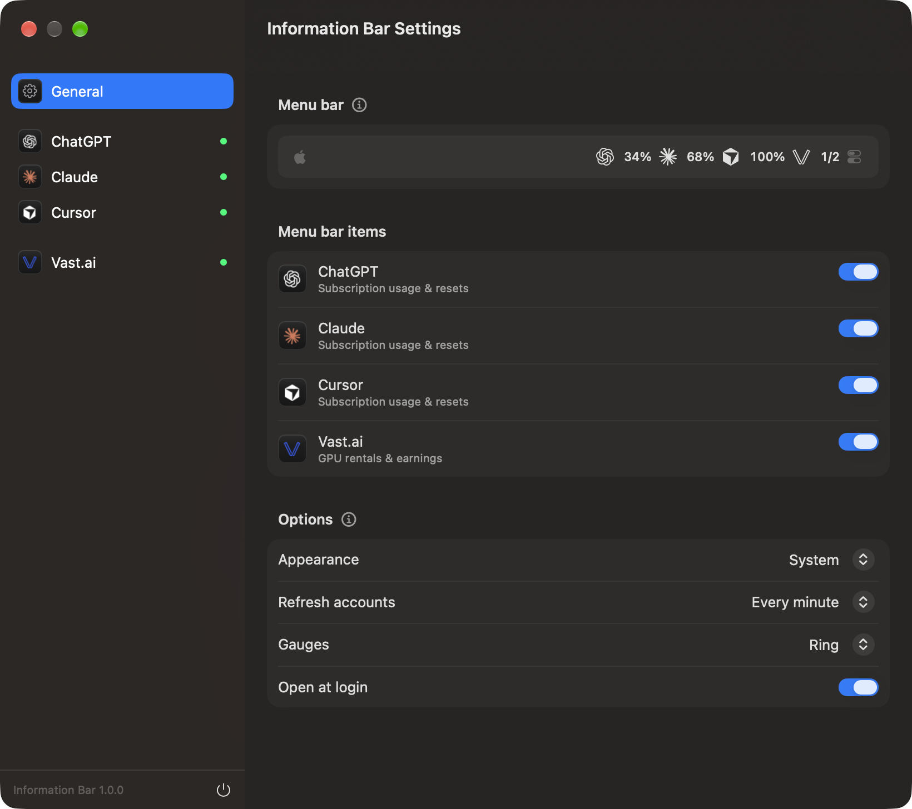

# Information Bar

Menu bar usage for ChatGPT, Claude and Cursor, plus Vast.ai rentals and earnings. Native macOS; everything stays on your Mac.

<p>
  
  
</p>


## What it shows

- ChatGPT, Claude and Cursor: every allowance pool with usage and reset time, including per-model weekly limits such as Claude's Fable cap.
- Vast.ai: rented machines with utilization, earnings today, hourly rate, a 7-day chart, and net figures after your power cost, in USD or EUR.
- Menu bar items you compose yourself per provider: icon, values, rings and a 7-day graph, as in iStat Menus.

## Install

Requires macOS 27, Python 3, and the signed-in Codex CLI, Claude Code and Cursor app. The Vast.ai API key is entered in Settings and kept in Keychain.

```sh
bash scripts/install-app.sh   # builds, installs in /Applications and opens the app
```

`bash scripts/build-app.sh` builds `dist/Information Bar.app` without installing. The build is ad-hoc signed for local use.

## How it works

A Python collector reads each provider's existing login, calls its usage endpoint and writes normalized metrics to a private cache. Tokens go only to their own provider; nothing else leaves your Mac. Endpoints, definitions and refresh rules: [docs/data-sources.md](docs/data-sources.md).

## Develop

```sh
python3 -m unittest discover -s tests -v   # collector
swift test                                  # app models
bash scripts/render-views.sh                # light and dark renders of every view
bash scripts/screenshots.sh                 # README screenshots from the app in demo mode
```

`--demo` runs the app on synthetic data; `--settings` and `--panel <provider>` open a window at launch.

## License

MIT. Provider marks are trademarks of their owners; see [assets/providers/README.md](assets/providers/README.md).
